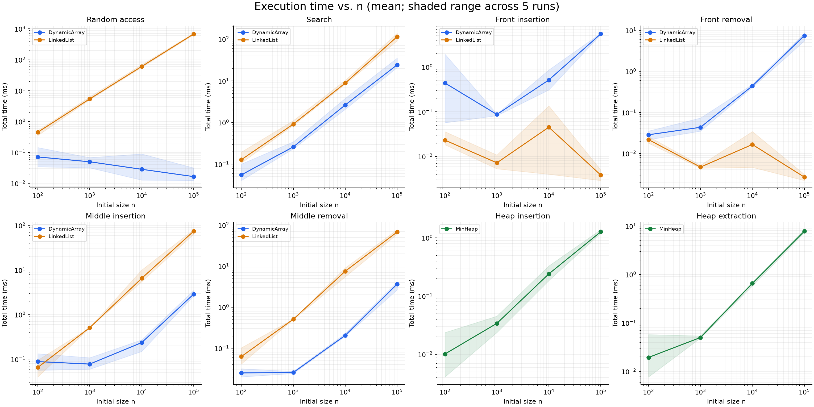
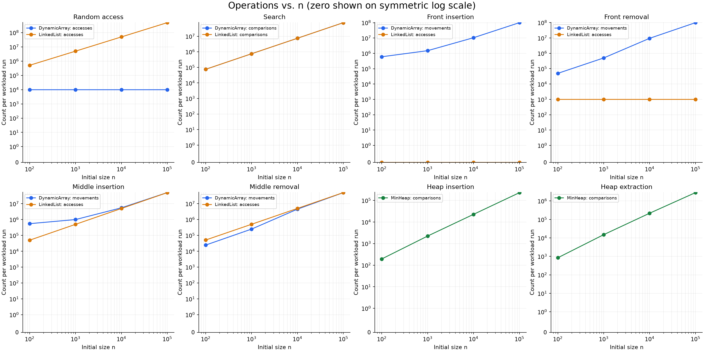

# Assignment 2 — Algorithmic Analysis, Correctness and Performance Trade-offs

## 1. Overview

This repository is the individual report and reproducible experiment for three manually implemented integer data structures: a dynamic array, a singly linked list with a tail pointer, and an array-backed binary min-heap. It connects correctness proofs and asymptotic bounds to measured time and operation counts under four fixed workloads.

The sequence implementations support `add(x)`, `add(index, x)`, `remove(index)`, `get(index)`, and `contains(x)`. The heap supports `insert(x)`, `peekMin()`, and `extractMin()`. Duplicates, negative numbers, and all Java `int` values are supported. Invalid sequence indices throw `IndexOutOfBoundsException`; an empty heap throws `NoSuchElementException` on peek or extraction. Removal returns the removed value. Index validation happens before mutation.

The required structures use no standard collection internally. Java's `ArrayList`, `PriorityQueue`, and sorting utilities are used only for testing and validation. Source files contain no code comments.

### Repository and execution

| Location | Purpose |
|---|---|
| [src](src) | Implementations, metric counters, benchmark, and tests |
| [scripts/analyze.py](scripts/analyze.py) | Validate raw results, calculate means and sample deviations, and regenerate tables and plots |
| [results/tables/raw.csv](results/tables/raw.csv) | All 280 measured trials |
| [results/tables/summary.csv](results/tables/summary.csv) | 56 configuration summaries, including minimum and maximum times |
| [results/tables/results.md](results/tables/results.md) | Complete readable benchmark tables |
| [results/plots](results/plots) | Two plots, each showing all eight measured phases |
| [results/environment.txt](results/environment.txt) | Actual runtime and machine metadata |

A JDK 8 or newer is required. The checked-in results used OpenJDK 25.0.1. Python 3.12 and the pinned Matplotlib dependency are needed only to regenerate plots and tables.

From the repository directory, with a matching JDK's `javac` and `java` on PATH:

```text
mkdir build
javac -d build src/*.java
java -cp build Tests
java -Xms256m -Xmx1g -cp build Benchmark
python -m pip install -r requirements.txt
python scripts/analyze.py
```

Re-running the benchmark replaces the measurement files. The analysis script regenerates the summary, plots, and Results tables below. The narrative discussion describes the original recorded run and should be reviewed after rerunning.

The test suite passed **411,863 assertions**. It covers empty and singleton structures, duplicates, extreme integers, boundary and invalid indices, restoration after emptying, 20,000 randomized mixed operations per structure, and 100,000-element inputs. Sequence outputs are compared with `ArrayList`; heap outputs with `PriorityQueue` and a sorted array. Heap order is checked after every mutation in the mixed and adversarial tests, and periodically during the large drain. Additional assertions verify exact metric counts.

## 2. Complexity Analysis

Let `s` be the current size during a single operation, `i` a valid index, and `c` allocated capacity. Workload notation uses `n` for the **initial** size and `m` for the number of measured operations. `O` is an asymptotic upper bound, `Ω` a lower bound, and `Θ` a matching upper and lower bound. All logarithms can be taken base two; constant bases do not change these bounds. Constant-time cases below apply to nonempty valid operations; empty contains is also constant time.

For indexed sequence operations, average case assumes a uniformly chosen valid index. Searches use a fixed positive fraction of misses and a uniform choice among stored positions for hits. Amortized bounds distribute capacity growth across a sequence of appends; they are explicitly distinguished from a probability-based average.

### Dynamic array

| Operation | Best | Average / amortized | Worst single call | Auxiliary space per call |
|---|---|---|---|---|
| `add(x)` | Θ(1) | Θ(1) amortized over appends | Θ(s) on growth | Θ(1), or Θ(s) on growth |
| `add(i, x)` | Θ(1), append with spare capacity | Θ(s), uniform i | Θ(s) | Θ(1), or Θ(s) on growth |
| `remove(i)` | Θ(1), last element | Θ(s), uniform i | Θ(s) | Θ(1) |
| `get(i)` | Θ(1) | Θ(1) | Θ(1) | Θ(1) |
| `contains(x)` | Θ(1), first element matches | Θ(s) under stated search model | Θ(s) | Θ(1) |

The backing array starts with capacity eight and doubles. Copying at successive growth points forms a geometric sum: fewer than twice the final capacity's order of magnitude in copied elements over an append sequence, giving O(N) total growth work across N appends and Ω(N) writes. Thus append is Θ(1) amortized, although a call on a full array is Θ(s). At a fixed full-capacity state even the expected next append costs Θ(s); amortization does not make that call constant time.

Indexed insertion shifts `s-i` existing values. Removal shifts `s-i-1`, and direct access reads one slot. Uniform indices give about half the array shifted. Search compares values until the first match or the end; a constant fraction of misses alone establishes Ω(s) expected work, and scanning establishes O(s). No shrinking occurs, so allocated storage is Θ(c), with c determined by the historical maximum size, not necessarily the current size after many removals. During growth, old and new arrays coexist, requiring Θ(s) additional space.

### Singly linked list

| Operation | Best | Average | Worst | Auxiliary space per call |
|---|---|---|---|---|
| `add(x)` | Θ(1) | Θ(1) | Θ(1) | Θ(1), one new node |
| `add(i, x)` | Θ(1), head or tail | Θ(s), uniform i | Θ(s) | Θ(1), one new node |
| `remove(i)` | Θ(1), head | Θ(s), uniform i | Θ(s) | Θ(1) |
| `get(i)` | Θ(1), head | Θ(s), uniform i | Θ(s) | Θ(1) |
| `contains(x)` | Θ(1), head matches | Θ(s) under stated search model | Θ(s) | Θ(1) |

The tail pointer makes append constant time. Head insertion links a new node to the former head. To insert at an interior index, the implementation visits `i` nodes to find the predecessor. Removal at index i visits `i+1` nodes including the removed node, and `get(i)` visits `i+1`. A tail pointer cannot supply the predecessor in a singly linked list, so tail removal still costs Θ(s). Relinking is constant time after traversal. The list stores Θ(s) nodes; each needs its value, a next reference, and JVM object overhead. Its auxiliary call space is constant because traversal is iterative.

### Min-heap

| Operation | Best | Average model described below | Worst single call | Auxiliary space per call |
|---|---|---|---|---|
| `insert(x)` | Θ(1), no growth and no upward swap | Θ(1) expected amortized during random-order construction | Θ(s) on growth; Θ(log s) without growth | Θ(1), or Θ(s) on growth |
| `peekMin()` | Θ(1) | Θ(1) | Θ(1) | Θ(1) |
| `extractMin()` | Θ(1), no downward swap needed | Θ(log s) as an average over draining a random distinct-key heap | Θ(log s) | Θ(1) |

The complete binary tree has height Θ(log s). Insertion compares a new value with ancestors; extraction moves the last value to the root and compares it with the smaller child at successive levels. Each level uses a constant number of comparisons. The root is already minimum, making peek constant time. All-equal heaps demonstrate constant-time extraction, so its best case is not logarithmic. Storage and growth use the same capacity policy as the dynamic array. For arbitrary inputs, insert has O(log s) amortized cost including resizing, with Ω(1) as its universal lower bound; an individual capacity expansion still costs Θ(s).

The tighter expected insertion result assumes a uniformly random permutation of distinct keys, averaged across building a heap from empty. Repeated insertion has linear expected total comparison work under this model, hence Θ(1) expected amortized work per insert after including geometric capacity growth. This is an average-case result, not a guarantee for descending input. [Hayward and McDiarmid, *Average Case Analysis of Heap Building by Repeated Insertion*](https://webdocs.cs.ualberta.ca/~hayward/papers/heap.pdf).

For a complete drain after such construction, the comparison-sorting lower bound is Ω(N log N) in expectation for N random distinct keys. Construction uses only O(N) expected comparisons; the drain must therefore use Ω(N log N), and its height bound supplies O(N log N). This proves Θ(log N) work per extraction averaged over the drain, not a tight expectation for every particular heap shape or size. The experiment uses bounded random integers with possible duplicates, so that distinct-key model is a useful comparison rather than an exact description of the input distribution.

## 3. Correctness

### Proof 1: `DynamicArray.add(index, value)`

Let the original size be s, insertion index k satisfy `0 <= k <= s`, and A be a conceptual copy of the original contents. This copy is notation for the proof, not memory allocated by the algorithm. Capacity growth, when needed, copies each old entry to the same index in a larger array. Its copy-loop invariant is that entries before the current copy index already equal A and the old array remains unchanged; this holds initially for an empty prefix and grows by one on each assignment. Thus growth preserves A and provides space for s+1 values.

**Loop invariant.** At the start of each shifting iteration with loop variable j: `k <= j <= s`; for every `0 <= p <= j-1`, `elements[p] = A[p]`; and for every `j+1 <= p <= s`, `elements[p] = A[p-1]`. In words, the suffix strictly beyond j has moved right once and the source prefix through j-1 is intact. Position j is the next destination.

**Initialization.** Initially j=s. The shifted suffix is empty, and all original positions 0 through s-1 still equal A. The bounds hold because k is a valid insertion index.

**Maintenance.** When j>k, the unchanged prefix supplies `elements[j-1] = A[j-1]`. Assigning it to `elements[j]` extends the correctly shifted suffix by one, without modifying any lower source slot. Decrementing j leaves exactly the prefix and suffix described by the invariant for the next iteration. Copying from right to left is essential to this preservation.

**Termination.** The nonnegative integer j-k decreases by one each iteration, so the loop stops at j=k. The invariant then gives `elements[p] = A[p-1]` for k+1 through s and unchanged A for 0 through k-1. Setting `elements[k] = value` and incrementing size produces exactly A's prefix, the inserted value, and A's suffix in order. This proves the required sequence, size, and capacity properties. It also handles appending, inserting at zero, and an empty array because the relevant ranges may be empty.

### Proof 2: `MinHeap.extractMin()`

The precondition is a nonempty valid min-heap. Every root-to-descendant path is nondecreasing, so the saved root is a minimum. The algorithm removes the final occupied position and places its value at the root. If the heap had one element, the resulting heap is empty and the loop is skipped, which is correct. Otherwise let j denote the current active index and x its replacement value.

**Loop invariant.** The occupied array remains a complete tree containing exactly the original multiset minus one occurrence of the saved minimum. Every parent-child edge is ordered except possibly edges from j to its children. The child subtrees of j are valid heaps. If j has a parent, that parent's value is at most every value in j's subtree; all previously repaired ancestors remain ordered.

**Initialization.** Removing the final leaf preserves completeness and all surviving edges away from the root. Moving that leaf's value to the root changes only the root's outgoing comparisons. Both child subtrees remain heaps, and the ancestor condition is vacuous at the root. The required multiset is preserved.

**Maintenance.** The algorithm selects the smaller existing child c. If x is at most c's value, it is at most both child roots, so all remaining possibly invalid edges are already ordered. Otherwise it swaps x with c and sets j=c. The promoted value is at most x and the other child's root; it is also at most every value in its original child subtree because that subtree was a heap. The ancestor bound ensures that this promotion cannot break the edge above the repaired node. Consequently all edges are ordered except possibly those leaving the new active index. Swapping preserves the multiset and shape, so the invariant holds again.

**Termination.** Each swap moves down one level in a finite complete tree. Thus the number of levels available below j strictly decreases. The loop stops at a leaf, or at the comparison showing x is at most its smaller child. A leaf has no outgoing edges to violate; in the comparison case both outgoing edges are valid. Together with the invariant, all edges now satisfy the heap property, the tree has one fewer value, and the returned saved root is the original minimum. Duplicate values cause no problem because the order relation is non-strict.

## 4. Experimental Setup

All four workloads use n = **100, 1,000, 10,000, 100,000**. Inputs are generated before timing with a fresh `Random(42)` for each n and reused across structures and repetitions. Initial values are `2 * random.nextInt(1_000_000)`, so they are even integers with possible duplicates. Every configuration has **two unreported warmup runs and five measured repetitions**. Structures are newly constructed for each experiment. The structure order alternates between repetitions. Results report the arithmetic mean and sample standard deviation of total elapsed milliseconds, not an average time per operation.

`System.nanoTime()` surrounds only the operation loops. Population, random data generation, validation, printing, CSV output, and Python analysis are outside timing. Allocations and capacity copies caused by the measured operations are inside timing. Checksums, search-hit accumulation, loop overhead, counter updates, and writing extracted values into a preallocated output array are included. A volatile sink and post-timing checks consume the results. There is no forced garbage collection. These are measurements of the instrumented implementations in one JVM, not isolated production microbenchmarks.

| Workload | Operations m | Fixed definition |
|---|---:|---|
| Random access | 10,000 | Uniform pre-generated indices from 0 through n-1; perform get for each |
| Search | 1,000 | Alternate 500 values sampled from stored positions with 500 guaranteed misses generated as odd integers |
| Front insertion | 1,000 | Insert a pre-generated value repeatedly at index 0 |
| Front removal | 1,000 | Remove repeatedly at index 0 using the restoration rule below |
| Middle insertion | 1,000 | Insert repeatedly at the fixed index floor(n/2) |
| Middle removal | 1,000 | Remove repeatedly at the fixed index floor(n/2), using the restoration rule |
| Priority insertion | n | Start with an empty heap and insert all n initial values |
| Priority extraction | n | Drain that heap into a preallocated array, then verify sorted order and equality with a sorted copy of the input |

**Resolving the removal specification.** A structure with n=100 cannot supply 1,000 removals without restoration, and fixed-middle removals also become invalid after the suffix is exhausted. For every n and position i, use batches of `min(remaining operations, n-i)` removals from a fresh original structure. Restore only between batches, outside all timed intervals; sum their elapsed times and counters into one repetition. Thus m stays exactly 1,000 and i always means the index derived from the original n, not half the changing size. Insertion and removal use independent original structures. Front-removal batch counts are 10, 1, 1, 1; middle-removal counts are 20, 2, 1, 1. The extra timer pairs for small n are included and may affect short timings. This documented adjustment is necessary to make the assignment executable.

### Metric definitions and exact predictions

All counters are 64-bit and reset after untimed population. A comparison means a comparison of stored keys with each other or with a search target, not a loop condition, bounds check, or pointer comparison. Heap insertion counts each parent/value comparison. Extraction counts the child-selection comparison when both children exist and the comparison between the active value and the selected child. Heap accesses and movements are not instrumented; zeros in those CSV/table fields mean unused metrics.

For arrays, an **access** is an existing value read by get, search, removal, shifting, or resizing; a **movement** is an existing value copied during shifting or resizing. The initial write of an inserted value and clearing the vacated slot are not movements. A copied value therefore contributes one access and one movement; the two columns must not be added as if they were independent work.

For lists, an **access** is an existing node visit during traversal or direct tail linking. A node reached by traversal is counted once even when several of its fields are read. Removal additionally counts the removed node. Head insertion dereferences no existing node and records zero visits, but still allocates and links a new node. It therefore costs Θ(1), not zero time. Lists move no stored values. These counts describe algorithmic work; an array read and a node visit are not interchangeable hardware memory accesses.

For m uniformly chosen get indices, an array performs exactly m accesses, while a list has expected `m(n+1)/2` node visits. Actual list visits are exactly the sum of `(index+1)`. Each unsuccessful search makes n comparisons; a successful search stops at the first occurrence. With distinct keys the chosen 50% hit mixture gives approximately `3mn/4` comparisons. Duplicates can shorten a hit search, but 500 guaranteed misses maintain a Θ(mn) lower bound.

For fixed-index array insertion, shifts total `m(n-i) + m(m-1)/2`; add the old capacity at every growth event to include resizing movements. Thus the total is Θ(mn+m²) at the front or original middle. A middle list insertion visits exactly mi nodes; front insertion visits none.

A removal batch of b operations makes `b(n-i-1) - b(b-1)/2` array movements. Sum over the defined batches and add m for array accesses to the returned values. List removals visit exactly `m(i+1)` nodes regardless of batching. The Python analysis independently checks these formulas, all 56 expected configurations, five repetitions per configuration, correct operation and batch counts, identical deterministic counts, equal search counts across structures, and 500 search hits per run.

The recorded environment was Windows 11 on amd64, an Intel Family 6 Model 183 processor with 16 processors visible to the JVM, and OpenJDK 25.0.1. JVM arguments were `-Xms256m -Xmx1g`. [Full environment record](results/environment.txt). Plot generation used Python 3.12 and Matplotlib 3.11.2.

## 5. Results

The following values are actual measurements from the checked-in raw trials. Theoretical bounds refer to an entire workload run. `Theta` in the generated tables denotes Θ. Search has identical counts in both structures, so the operation-count curves overlap. Linked-list front insertion has zero counted visits, represented by a symmetric logarithmic count axis. Each timing band spans the minimum and maximum of the five trials; it is not a confidence interval.





<!-- RESULTS_START -->

Each mean and sample standard deviation uses five measured repetitions. Counts are identical across all five repetitions; they are totals per workload run, not per operation. Times are milliseconds. Theory describes the entire timed workload; m is shown explicitly.

### Random access

| Structure | n | m | Mean ms | SD ms | Accesses | Movements | Comparisons | Batches | Workload theory |
|---|---:|---:|---:|---:|---:|---:|---:|---:|---|
| DynamicArray | 100 | 10,000 | 0.071600 | 0.043581 | 10,000 | 0 | 0 | 1 | Theta(m) |
| LinkedList | 100 | 10,000 | 0.451700 | 0.062261 | 511,327 | 0 | 0 | 1 | Theta(mn) expected |
| DynamicArray | 1,000 | 10,000 | 0.050020 | 0.016781 | 10,000 | 0 | 0 | 1 | Theta(m) |
| LinkedList | 1,000 | 10,000 | 5.403840 | 0.515878 | 5,021,262 | 0 | 0 | 1 | Theta(mn) expected |
| DynamicArray | 10,000 | 10,000 | 0.028580 | 0.034281 | 10,000 | 0 | 0 | 1 | Theta(m) |
| LinkedList | 10,000 | 10,000 | 60.405340 | 5.190401 | 50,188,951 | 0 | 0 | 1 | Theta(mn) expected |
| DynamicArray | 100,000 | 10,000 | 0.016580 | 0.008460 | 10,000 | 0 | 0 | 1 | Theta(m) |
| LinkedList | 100,000 | 10,000 | 677.218600 | 31.119612 | 504,940,938 | 0 | 0 | 1 | Theta(mn) expected |

### Search

| Structure | n | m | Mean ms | SD ms | Accesses | Movements | Comparisons | Batches | Workload theory |
|---|---:|---:|---:|---:|---:|---:|---:|---:|---|
| DynamicArray | 100 | 1,000 | 0.055540 | 0.025948 | 75,130 | 0 | 75,130 | 1 | Theta(mn) expected |
| LinkedList | 100 | 1,000 | 0.128340 | 0.038621 | 75,130 | 0 | 75,130 | 1 | Theta(mn) expected |
| DynamicArray | 1,000 | 1,000 | 0.260500 | 0.048583 | 751,127 | 0 | 751,127 | 1 | Theta(mn) expected |
| LinkedList | 1,000 | 1,000 | 0.916280 | 0.111462 | 751,127 | 0 | 751,127 | 1 | Theta(mn) expected |
| DynamicArray | 10,000 | 1,000 | 2.636200 | 0.713809 | 7,451,537 | 0 | 7,451,537 | 1 | Theta(mn) expected |
| LinkedList | 10,000 | 1,000 | 8.827180 | 0.872234 | 7,451,537 | 0 | 7,451,537 | 1 | Theta(mn) expected |
| DynamicArray | 100,000 | 1,000 | 24.265640 | 6.154817 | 74,711,244 | 0 | 74,711,244 | 1 | Theta(mn) expected |
| LinkedList | 100,000 | 1,000 | 114.873480 | 20.729379 | 74,711,244 | 0 | 74,711,244 | 1 | Theta(mn) expected |

### Front insertion

| Structure | n | m | Mean ms | SD ms | Accesses | Movements | Comparisons | Batches | Workload theory |
|---|---:|---:|---:|---:|---:|---:|---:|---:|---|
| DynamicArray | 100 | 1,000 | 0.438960 | 0.840738 | 601,420 | 601,420 | 0 | 1 | Theta(mn + m^2) |
| LinkedList | 100 | 1,000 | 0.023160 | 0.007229 | 0 | 0 | 0 | 1 | Theta(m) |
| DynamicArray | 1,000 | 1,000 | 0.087020 | 0.003008 | 1,500,524 | 1,500,524 | 0 | 1 | Theta(mn + m^2) |
| LinkedList | 1,000 | 1,000 | 0.007200 | 0.002316 | 0 | 0 | 0 | 1 | Theta(m) |
| DynamicArray | 10,000 | 1,000 | 0.512880 | 0.206705 | 10,499,500 | 10,499,500 | 0 | 1 | Theta(mn + m^2) |
| LinkedList | 10,000 | 1,000 | 0.045060 | 0.059013 | 0 | 0 | 0 | 1 | Theta(m) |
| DynamicArray | 100,000 | 1,000 | 5.507140 | 0.154635 | 100,499,500 | 100,499,500 | 0 | 1 | Theta(mn + m^2) |
| LinkedList | 100,000 | 1,000 | 0.003840 | 0.000826 | 0 | 0 | 0 | 1 | Theta(m) |

### Front removal

| Structure | n | m | Mean ms | SD ms | Accesses | Movements | Comparisons | Batches | Workload theory |
|---|---:|---:|---:|---:|---:|---:|---:|---:|---|
| DynamicArray | 100 | 1,000 | 0.028580 | 0.005752 | 50,500 | 49,500 | 0 | 10 | Theta(mn) under batching rule |
| LinkedList | 100 | 1,000 | 0.021780 | 0.003596 | 1,000 | 0 | 0 | 10 | Theta(m) |
| DynamicArray | 1,000 | 1,000 | 0.043400 | 0.016738 | 500,500 | 499,500 | 0 | 1 | Theta(mn) under batching rule |
| LinkedList | 1,000 | 1,000 | 0.004660 | 0.000329 | 1,000 | 0 | 0 | 1 | Theta(m) |
| DynamicArray | 10,000 | 1,000 | 0.441460 | 0.037453 | 9,500,500 | 9,499,500 | 0 | 1 | Theta(mn) under batching rule |
| LinkedList | 10,000 | 1,000 | 0.016560 | 0.013736 | 1,000 | 0 | 0 | 1 | Theta(m) |
| DynamicArray | 100,000 | 1,000 | 7.440560 | 1.140473 | 99,500,500 | 99,499,500 | 0 | 1 | Theta(mn) under batching rule |
| LinkedList | 100,000 | 1,000 | 0.002660 | 0.000391 | 1,000 | 0 | 0 | 1 | Theta(m) |

### Middle insertion

| Structure | n | m | Mean ms | SD ms | Accesses | Movements | Comparisons | Batches | Workload theory |
|---|---:|---:|---:|---:|---:|---:|---:|---:|---|
| DynamicArray | 100 | 1,000 | 0.088420 | 0.031700 | 551,420 | 551,420 | 0 | 1 | Theta(mn + m^2) |
| LinkedList | 100 | 1,000 | 0.065420 | 0.024359 | 50,000 | 0 | 0 | 1 | Theta(mn) |
| DynamicArray | 1,000 | 1,000 | 0.077840 | 0.021141 | 1,000,524 | 1,000,524 | 0 | 1 | Theta(mn + m^2) |
| LinkedList | 1,000 | 1,000 | 0.510160 | 0.003055 | 500,000 | 0 | 0 | 1 | Theta(mn) |
| DynamicArray | 10,000 | 1,000 | 0.235640 | 0.049553 | 5,499,500 | 5,499,500 | 0 | 1 | Theta(mn + m^2) |
| LinkedList | 10,000 | 1,000 | 6.503260 | 1.967996 | 5,000,000 | 0 | 0 | 1 | Theta(mn) |
| DynamicArray | 100,000 | 1,000 | 2.873960 | 0.357913 | 50,499,500 | 50,499,500 | 0 | 1 | Theta(mn + m^2) |
| LinkedList | 100,000 | 1,000 | 73.879140 | 6.378436 | 50,000,000 | 0 | 0 | 1 | Theta(mn) |

### Middle removal

| Structure | n | m | Mean ms | SD ms | Accesses | Movements | Comparisons | Batches | Workload theory |
|---|---:|---:|---:|---:|---:|---:|---:|---:|---|
| DynamicArray | 100 | 1,000 | 0.025020 | 0.005945 | 25,500 | 24,500 | 0 | 20 | Theta(mn) under batching rule |
| LinkedList | 100 | 1,000 | 0.062640 | 0.024865 | 51,000 | 0 | 0 | 20 | Theta(mn) under batching rule |
| DynamicArray | 1,000 | 1,000 | 0.025660 | 0.001297 | 250,500 | 249,500 | 0 | 2 | Theta(mn) under batching rule |
| LinkedList | 1,000 | 1,000 | 0.507980 | 0.005763 | 501,000 | 0 | 0 | 2 | Theta(mn) under batching rule |
| DynamicArray | 10,000 | 1,000 | 0.205360 | 0.013574 | 4,500,500 | 4,499,500 | 0 | 1 | Theta(mn) under batching rule |
| LinkedList | 10,000 | 1,000 | 7.510700 | 1.522482 | 5,001,000 | 0 | 0 | 1 | Theta(mn) under batching rule |
| DynamicArray | 100,000 | 1,000 | 3.665300 | 0.581543 | 49,500,500 | 49,499,500 | 0 | 1 | Theta(mn) under batching rule |
| LinkedList | 100,000 | 1,000 | 67.799820 | 6.666932 | 50,001,000 | 0 | 0 | 1 | Theta(mn) under batching rule |

### Heap insertion

| Structure | n | m | Mean ms | SD ms | Accesses | Movements | Comparisons | Batches | Workload theory |
|---|---:|---:|---:|---:|---:|---:|---:|---:|---|
| MinHeap | 100 | 100 | 0.010140 | 0.008612 | 0 | 0 | 194 | 1 | Theta(n) expected random distinct order; O(n log n) worst |
| MinHeap | 1,000 | 1,000 | 0.034020 | 0.007870 | 0 | 0 | 2,232 | 1 | Theta(n) expected random distinct order; O(n log n) worst |
| MinHeap | 10,000 | 10,000 | 0.240000 | 0.060112 | 0 | 0 | 22,593 | 1 | Theta(n) expected random distinct order; O(n log n) worst |
| MinHeap | 100,000 | 100,000 | 1.268260 | 0.069865 | 0 | 0 | 227,662 | 1 | Theta(n) expected random distinct order; O(n log n) worst |

### Heap extraction

| Structure | n | m | Mean ms | SD ms | Accesses | Movements | Comparisons | Batches | Workload theory |
|---|---:|---:|---:|---:|---:|---:|---:|---:|---|
| MinHeap | 100 | 100 | 0.019420 | 0.021500 | 0 | 0 | 841 | 1 | O(n log n) |
| MinHeap | 1,000 | 1,000 | 0.050060 | 0.002291 | 0 | 0 | 14,994 | 1 | O(n log n) |
| MinHeap | 10,000 | 10,000 | 0.656680 | 0.044061 | 0 | 0 | 216,736 | 1 | O(n log n) |
| MinHeap | 100,000 | 100,000 | 7.809360 | 0.430656 | 0 | 0 | 2,831,463 | 1 | O(n log n) |

<!-- RESULTS_END -->

## 6. Discussion

### Increasing n and agreement with theory

**Random access.** As n increased from 100 to 100,000, array accesses remained exactly 10,000. List visits grew from 511,327 to 504,940,938, close to the expected `m(n+1)/2`. List mean time rose from 0.452 ms to 677.219 ms. The constant array count and almost linear list count strongly support Θ(m) versus expected Θ(mn). At the largest n the array took 0.016580 ms; the very large observed timing ratio is specific to this instrumented run, not a universal speedup.

**Search.** Both structures performed precisely 75,130, 751,127, 7,451,537, and 74,711,244 comparisons at the four sizes. This is close to the predicted three quarters of mn, confirming that the same targets and data were used. At n=100,000, the means were 24.266 ms for the array and 114.873 ms for the list, about a 4.7-fold difference despite identical Θ(mn) work in key comparisons. Contiguous primitive storage and pointer traversal are plausible causes of this gap; the experiment did not measure cache misses directly.

**Insertion and removal.** At n=100,000, front insertion moved 100,499,500 array values and took 5.507 ms; the list took 0.003840 ms with zero existing-node visits. Front removal moved 99,499,500 array values versus only 1,000 list node visits, and means were 7.441 ms versus 0.002660 ms. These findings agree with shifting versus constant-time head updates. List node allocation is inside insertion timing even though it is absent from the visit count.

At the fixed original middle, array insertion moved 50,499,500 values and took 2.874 ms; list insertion visited 50,000,000 nodes and took 73.879 ms. Middle removal similarly took 3.665 ms for 49,499,500 array movements versus 67.800 ms for 50,001,000 list visits. Both are linear in n for fixed m, yet traversal made the list substantially slower here. The constant-time splice does not remove the cost of locating the predecessor. At small n, m² insertion work is significant: inserting 1,000 values into an initial 100-element array changes the size greatly, so simple proportionality to the initial n is not expected.

**Priority processing.** Insertion comparisons grew from 194 to 227,662, or roughly 1.94 to 2.28 per inserted value. The observed total is near linear for these random inputs, consistent with the random-order construction model and below the O(n log n) worst-case bound. It does not establish a worst-case constant-time insert. Extracting all values required 841, 14,994, 216,736, and 2,831,463 comparisons; comparisons per extracted value rose from 8.41 to 28.31 as the height increased. At n=100,000, insertion took 1.268 ms and extraction 7.809 ms. From 10,000 to 100,000, extraction comparisons grew about 13.1-fold, close to the 12.5-fold increase in n log2(n). Every extracted array matched a sorted input copy. Peek is Θ(1) by implementation and is tested, but no separate peek benchmark is claimed.

### Deviations, constants, and limits

Array random-access mean time decreased from 0.071600 ms to 0.016580 ms even though its counted work stayed constant. Array front insertion at n=100 was slower than at n=1,000, with an unusually large sample deviation (0.841 ms on a 0.439 ms mean). Linked-list head operations also show irregular short timings. These observations do not imply subconstant asymptotic cost. Two warmups cannot guarantee completed JIT optimization; configurations run in increasing n order, and scheduling, compilation, allocation, timer overhead, and garbage collection can influence results. The recorded data does not identify which of these caused each fluctuation. All five trials, including slow ones, remain in the averages.

Big-O describes growth, not elapsed nanoseconds or equal constants. A list visit entails dependent pointer accesses and larger objects; an array stores adjacent primitive integers. Bounds checks, branches, runtime compilation, allocation, and the treatment of simple copy loops can change constants. Metric increments themselves are part of the measured implementations and may be optimized differently by the JVM. These facts explain why equal comparison or visit counts are not enough to predict equal time.

The experiment uses one fixed seed, one JVM process, and five repetitions. It does not independently vary hardware, garbage collectors, key distributions, or seeds, and it does not isolate cache behavior. The primitive structures avoid boxing, so results are not a direct performance comparison with Java's collection classes. The list's node visits and the array's copied values are different units. Strongest conclusions come from the exact count growth together with the larger workloads; tiny timing differences and precise speed ratios should not be generalized. More repetitions, independent JVM forks, randomized size order, and separate uninstrumented timing runs would strengthen a follow-up study.

## 7. Design Recommendations

| Workload need | Suitable structure | Reason grounded in this experiment |
|---|---|---|
| Frequent indexed reads | Dynamic array | Exactly one access per get; the list approached 505 million visits for 10,000 reads at the largest size |
| Append and sequential search | Dynamic array in typical read-heavy use | Amortized constant append and compact storage; search made the same comparisons as the list but was faster here |
| Repeated head insertion/removal | Linked list | Constant head updates; no suffix shifting, and exactly one node visited per head removal |
| Edits at an integer middle index | Dynamic array for this implementation and measured workload | Both require linear work, but contiguous shifts were much faster than locating list predecessors |
| Splicing after a node already held by a cursor | Linked-list design with a cursor API | A known predecessor permits constant-time relinking; this repository's index API does not expose that advantage directly |
| Repeated minimum selection with new arrivals | Min-heap | Root minimum in constant time, logarithmic repair, and sorted verified extraction without repeatedly scanning every remaining element |

A heap encodes priority order, not arbitrary sequence positions. It is appropriate for tasks such as selecting the next lowest-cost job, while arrays and lists fit position-based operations. For a fixed batch that only needs one final sort, this experiment does not show that a heap beats a dedicated sorting algorithm. The choice should follow the mix of reads, searches, head changes, indexed edits, and priority operations, plus memory requirements and acceptable occasional growth costs.

## 8. Conclusion

Correctness follows from representation-preserving operations, the two loop-invariant proofs, and comparison-based validation across boundary, random, duplicate, and large cases. Exact benchmark counts support constant-time array indexing, linear sequential search, suffix-shifting costs in arrays, predecessor traversal in linked lists, and height-dependent heap extraction. Random heap construction used nearly constant comparisons per inserted value, while worst-case repair and occasional resizing retain their larger bounds. Measured timings show why storage layout and workload details matter alongside asymptotic notation. The complete source, raw data, plots, environment record, and regeneration commands make those conclusions reproducible.
